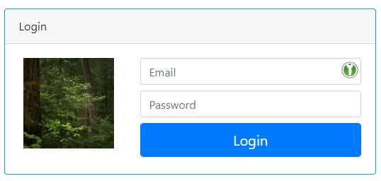

# Angular Portfolio

This project was generated with [Angular CLI](https://github.com/angular/angular-cli) version 10.0.4 and it was created following the tutorial from the ebook Practical Angular: Build your first web apps with Angular.

Firebase project was created in the website to be used for authentication purpose. It is just done in [Firebase console](https://console.firebase.google.com/).

AngularFire is needed to be installed because it is the Firebase SDK: `ng add @angular/fire`.

An important detail is about firebase config that contains access data for the project in the Firebase, that's why these data was added to a separate file inside [environment folder](src/environments/firebaseConfig.ts), but it is needed to pay attention for the fact that it is not present in the GitHub repo, because it is being ignored by the gitignore, so if it is necessary to use in another project, it has to be done manually.

            export const environment = {
               production: false,
               firebaseConfig: {
                 apiKey: "YOUR_API_KEY",
                 authDomain: "YOUR_AUTH_DOMAIN",
                 databaseURL: "YOUR_DATABASE_URL",
                 projectId: "YOUR_PROJECT_ID",
                 storageBucket: "YOUR_STORAGE_BUCKET",
                 messagingSenderId: "YOUR_MESSAGING_SENDER_ID",
               }
             };

There is a difference from the code when the ebook was written, so now there's no auth in the call: `await this.afAuth.auth.signInWithEmailAndPassword(email, password)`, neither in other call like signout, then just removing auth is enough for it works.

[Login page](src/app/admin/login/login.component.html) received some lines using boostrap to draw fancy but simple fields as shown below and it is using images from the website https://placeimg.com/128/128/nature that changes randomly:

  

## Router Guards

The tutorial implemented with Router Guards in order to secure the app routers and the [admin guard component](src/app/admin/admin.guard.ts). The canActivate() method will return true if the user is logged in or false otherwise. To determine if the guard needs to allow or disallow access to certain routes it uses the arguments below:

1. next: ActivatedRouteSnapshot - the next route that will be activated if the guard is allowing access;
2. state: RouterStateSnapshot - the next router state if the guard is allowing access.

It is used in routes module, so the [admin routing module](src/app/admin/admin-routing.module.ts) was added with `canActivate: [AdminGuard]` in each line of the routes constant which we want to protect. The ProjectListComponent, ProjectCreateComponent and ProjectUpdateComponent components of the admin module from non logged in users. The canActivate property of the path object takes an array which means it can register multiple guards. A detail here is that the default form of the canActivate method is to return true, so it is neeeded to add a if statement to check the is logged in using the method created at the [auth service](src/app/auth/auth.service.ts): `this.authService.isLoggedIn`.

Route Guards return an UrlTree variable which provides the new router state (route) that should be activated, as well a boolean (`Promisse<boolean>` or `Observable<boolean>`). UrlTree is a data structure that represents a parsed URL. 

## Contact and Create project form

[Contact form](src/app/contact/contact.component.html) was created as template-based form. The `#myform = "ngForm"` syntax creates a local template variable that will allow to work with the form object, that is passed as argument in the onSubmit method. In fact, the form was automatically created when was imported the FormsModule in the project. The NgForm object that represents the form which provides a plain JS object that contains the attributes of the form and their values. In this example, it simply print the form value in the console but in a real-world situation, we can use it to send the data to a server via a POST request.

[Create project form](src/app/admin/project-create-component/project-create.component.html) was implemented as a Reactive form example, which demands to import FormsModule and ReactiveFormsModule.

## CRUD in Firebase

For this part it was used partially a little tutorial [angular-9-8-firestore-database-crud-tutorial](https://www.techiediaries.com/angular-firebase/angular-9-8-firestore-database-crud-tutorial/), but it wasn't enough, so [Angular with Firestore](https://www.mode2.com/news/part-two-angular-with-firestore-intro/) was clearer to be implemented.

Timestamp gave some trouble to be shown, so searching for datepipe solution I found some posts about [firebase timestamp at stackoverflow](https://stackoverflow.com/questions/50770723/how-to-convert-the-firebase-timestamp-using-angular-date-pipe/50882402) and the solution was to put timestamp format at the model and use `toDate` in the field at the [policy component](src/app/components/policy/policy.component.html) with datepipe.

Glyphicon is not supported from Bootstrap 4 on. So installing the [ng-bootstrap-icons](https://github.com/biutas/ng-bootstrap-icons#readme) was a solution. It could be font awesome or even angular material, but for this project I decided to keep it simple and focus in firebase methods and Angular operations.

A problem to add policy to firebase happened and the solution that worked was to parse to JSON (stringfy) firstly before calling the add method: `const jsonPol = JSON.parse(JSON.stringify(policy));`. Another question was to use Timestamp, because the format that is created in the Firebase natively, it works well, but when saving (adding) it to Firebase, I couldn't adjust to the same format, so after it was a problem to read because it wasn't recognizied as Timestamp, therefore I changed to Date in the [model](src/app/components/policy.model.ts) for Date type and I send the same type to be added, so this way it is possible to make it compatible to read and write operations.

## [Firebase Hosting](https://www.mode2.com/news/part-one-angular-with-firebase-hosting/) 

This project was deployed to Firebase using Hosting. First the [Firebase CLI](https://firebase.google.com/docs/cli#windows-npm) was needed and installed with npm command `npm install -g firebase-tools`. Some commands to test and use: firebase login, firebase projects:list, firebase init. One interesting thing was that I didn't need to init the project, I think the reason was the authentication method implemented and used to log in.

In the tutorial was said that `ng build --prod` would ask for setting up the public directory, but actually it didn't do it, but created straight the directory dist/angular-portfolio. So `Firebase deploy --project angular-portfolio-8b182` and then it gave the message:

            Project Console: https://console.firebase.google.com/project/angular-portfolio-8b182/overview
            Hosting URL: https://angular-portfolio-8b182.web.app

## [Uploading a file](https://indepth.dev/implement-file-upload-with-firebase-storage/)

It was used a tutorial from [indepth.dev](https://indepth.dev/) that implements a way to upload file to Firebase. So some methods like readAsDataURL, onload (receives from Progress<FileReader> that takes from result in which contains file's data as a base64 enconded string) from FileReader were used to treat the images. 

Here was implemented a piece of code to take the user when logged in, and it was put in [policy-create](src/app/components/policy-create/policy-create.component.ts).

I had a great difficulty to find a tutorial to give precise result without error, so I had to mix many of them [angular 7 reactive-forms-validation](https://www.positronx.io/angular-7-reactive-forms-validation-tutorial/), [angular 8 show-image-preview]https://www.positronx.io/angular-8-show-image-preview-with-reactive-forms-tutorial/), [file-upload-with-angular](https://www.codingforentrepreneurs.com/blog/file-upload-with-angular/) and some stackOverFlow off course.

The part of sending file to Firebase Storage was [the tutorial](https://indepth.dev/implement-file-upload-with-firebase-storage/#setting-up-angularfire-storage) of this section, in which AngularFireStorage has all already done, but the upload progress demanded to find tutorials by the web.

I had a big problem to find a solution that works in this project, so it was necessary a mix of pieces of code, cut from some tutorials ([Implement file upload with Firebase Storage](https://indepth.dev/implement-file-upload-with-firebase-storage/), [Upload Multiple Files to Firebase Storage](https://fireship.io/lessons/angular-firebase-storage-uploads-multi/), [UPLOADING AN IMAGE TO FIREBASE](https://dev.to/fayvik/uploading-an-image-to-firebase-cloud-storage-with-angular-2aeh), [How to upload and display image file](https://medium.com/@AnkitMaheshwariIn/how-to-upload-and-display-image-file-in-pwa-angular-project-using-firebase-cloud-storage-and-95763bc83da7), [Angular 10/9 File Upload Tutorial](https://www.techiediaries.com/angular-file-upload-progress-bar/), [Implement file upload with Firebase Storage](https://dev.to/angular/implement-file-upload-with-firebase-storage-in-our-angular-app-the-simple-way-1ofi)).

Another difficulty was about error of permission: `ERROR FirebaseError: Missing or insufficient permissions`, so again I needed to mix some solutions from web: [stackOverFlow (better answer was != null)](https://stackoverflow.com/questions/46590155/firestore-permission-denied-missing-or-insufficient-permissions?rq=1), [Granular permissions - youtube](https://www.youtube.com/watch?v=9sOT5VOflvQ).

Sorting 

## Sorting

Sorting was implemented in the [admin routing module](src/app/components/policy-list/policy-list.component.ts) and as usual I had to mix solutions to reach the final result. First I used the solution from [pluralsight - Angular Fundamentals chapter 10](https://app.pluralsight.com/course-player?clipId=cb7b52c0-1247-407b-a132-937845edd096), where it is made filtering and sorting. The tricky part, despite so easy, was to reverse the order (just multiply by -1) and I needed to search and I found in a page [Basic Array Sorting](https://www.sitepoint.com/sort-an-array-of-objects-in-javascript/), that has a method example for dynamic sorting function and other array sorting.

It was put a dropdown to select which field to be used to sort data, so bootstrap [dropdown](https://getbootstrap.com/docs/4.3/components/dropdowns/) was used, but it requires Poper.js to be installed - [stackOverFlow](https://stackoverflow.com/questions/45661863/bootstrap-min-js6-uncaught-error-bootstrap-dropdown-require-popper-js). Another detail was the fact to need to use select tag instead of the way shown in the Bootstrap page and the [template reference variable #](https://angular.io/guide/template-reference-variables) was used

## Development server

Run `ng serve` for a dev server. Navigate to `http://localhost:4200/`. The app will automatically reload if you change any of the source files.

## Code scaffolding

Run `ng generate component component-name` to generate a new component. You can also use `ng generate directive|pipe|service|class|guard|interface|enum|module`.

## Build

Run `ng build` to build the project. The build artifacts will be stored in the `dist/` directory. Use the `--prod` flag for a production build.

## Running unit tests

Run `ng test` to execute the unit tests via [Karma](https://karma-runner.github.io).

## Running end-to-end tests

Run `ng e2e` to execute the end-to-end tests via [Protractor](http://www.protractortest.org/).

## Further help

To get more help on the Angular CLI use `ng help` or go check out the [Angular CLI README](https://github.com/angular/angular-cli/blob/master/README.md).
